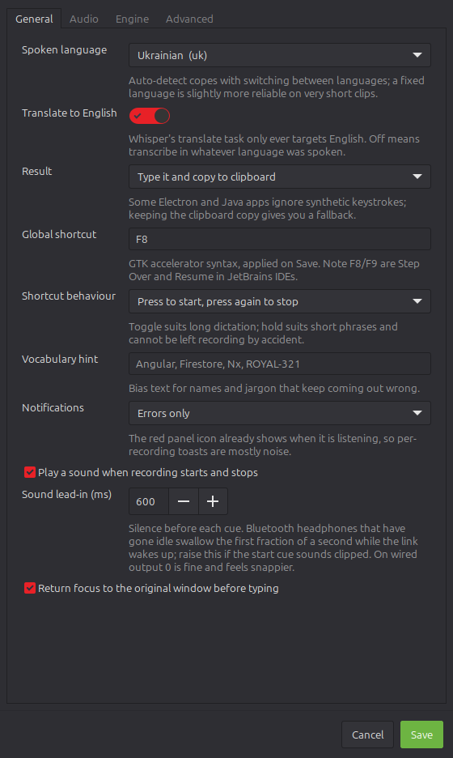
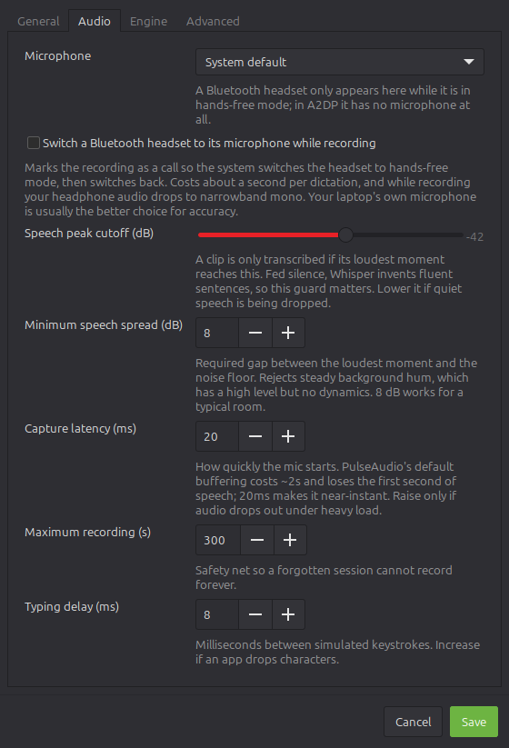
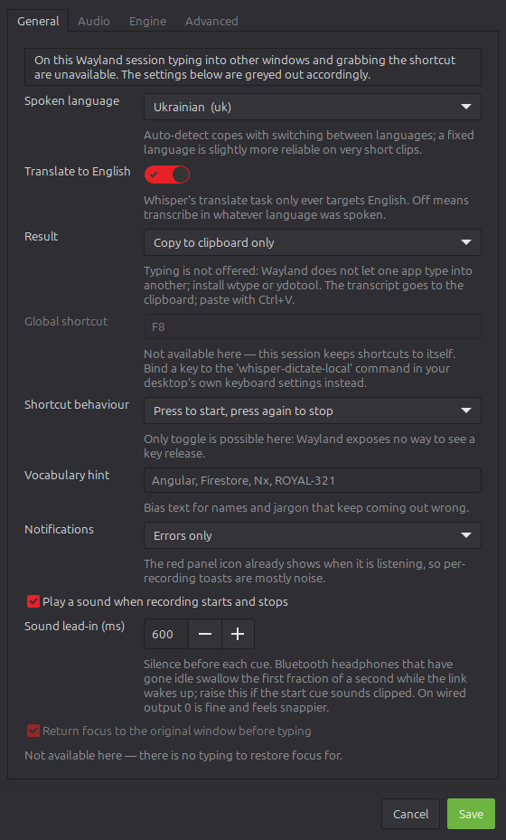

# whisper-dictate-local

Push-a-key dictation for Linux. Speak, and the text appears in whatever window
you were already typing in. Everything runs locally on the GPU via
[whisper.cpp](https://github.com/ggml-org/whisper.cpp) — no API keys, no audio
leaving the machine.

It works two ways, switched by a single setting:

- **Transcribe** — the text comes out in the language you spoke. Whisper handles
  around a hundred, and the dialog offers a shortlist you can extend by hand.
- **Translate to English** — speak any supported language, get English. This is
  Whisper's own translate task, and English is the only target it has; other
  target languages would need a separate translation step.

The author's daily use is Ukrainian in, English out, which is why the shortlist
and the defaults start there.

Developed on Linux Mint / Cinnamon, and works on any **X11** desktop. Wayland
is limited unless `wtype` or `ydotool` is present, and there is a macOS menu
bar front end that has not yet been run on a Mac — see
[Compatibility](#compatibility).

**Just want it running?** → [Requirements](#requirements) → [Install](#install)

| Section | What is in it |
|---|---|
| [How it works](#how-it-works) | the pipeline, and the two shortcut behaviours |
| [Compatibility](#compatibility) | which distributions and sessions this runs on |
| [Requirements](#requirements) | models, and building whisper.cpp for your GPU (or none) |
| [Install](#install) | step by step for Linux, macOS and BSD |
| [Panel icon](#panel-icon) | what each colour means |
| [Settings](#settings) | every option, with screenshots |
| [Getting good results](#getting-good-results) | mic levels, Bluetooth headsets, hallucinations |
| [Troubleshooting](#troubleshooting) | when nothing is typed |
| [Design notes](#design-notes) | why it is built the way it is |

## How it works

```
global shortcut ──► whisper-dictate-local ──► tray app (SIGUSR1)
                                                  │
                                    parecord ─────┤ raw PCM
                                                  │
                                  silence gate ───┤ (RMS dBFS)
                                                  │
                              whisper-server ─────┤ HTTP, model stays resident
                                                  │
                                 xdotool type ────┘ + clipboard copy
```

Two shortcut behaviours, switchable in Settings:

- **Toggle** (default) - press to start, press again to stop. Good for longer
  dictation; you are not holding a key down while you think.
- **Hold to talk** - records only while the key is held. Good for short phrases,
  and it cannot be left recording by accident.

Hold mode needs `python3-xlib`. Shortcut libraries report key *presses* only, so
the release is detected by reading the X keymap directly (`XQueryKeymap`) every
40ms. Without Xlib the app stays in toggle mode and says so.

## Compatibility

The thing that decides whether this works is **your session type, not your
distribution**. The app types text with `xdotool`, grabs the hotkey with
Keybinder and reads held keys with `XQueryKeymap` — all three are X11. That line
runs straight through Ubuntu and Fedora rather than around them, because both
ship a Wayland session by default.

| Session | Result |
|---|---|
| **X11 / Xorg** | everything works: typing, hold-to-talk, focus restore |
| **Wayland** | clipboard output, unless `wtype` or `ydotool` is installed |
| **macOS** | menu bar front end, written but [never run on a Mac](#macos--needs-testing) |
| **BSD** | [should work](#bsd--should-work-untested), untested, CPU-only |

The command-line half — record, transcribe, deliver — has no Linux dependency
left in it and runs anywhere Python does. Only the tray is toolkit-bound.

### Verified

- **Linux Mint 22 (Cinnamon, X11)** — the development machine. Everything below
  is tested here.

### Expected to work unchanged

Any X11 session on a systemd distribution with a panel that shows app
indicators. Only the package names differ:

| Distribution | Notes |
|---|---|
| Mint (Cinnamon / MATE / Xfce) | X11 by default — nothing to change |
| Debian 12, Ubuntu **on Xorg** | pick "Ubuntu on Xorg" at the login screen |
| Kubuntu / KDE Plasma **on X11** | Plasma shows indicators natively |
| Fedora Xfce / Cinnamon spins | X11 by default |
| Arch, EndeavourOS, Manjaro (X11) | — |
| openSUSE (X11) | — |
| Pop!_OS | X11 by default |

These follow from the code rather than from testing: the installer uses only
freedesktop standard paths (`~/.local/bin`, `~/.config/autostart`, hicolor
icons, `.desktop` files), and audio playback already falls back across
`paplay` → `pw-play` → `aplay`, so PulseAudio and PipeWire are both fine.
If you run one of these, a report either way is welcome.

**GNOME needs an extension.** GNOME Shell removed the legacy tray, so the panel
icon requires `gnome-shell-extension-appindicator`. Ubuntu ships and enables it
by default; on stock Fedora GNOME you must install it yourself.

### Wayland — partially

Not a packaging gap; Wayland deliberately forbids one client from injecting
input into another. On a Wayland session:

- **The clipboard works.** Install `wl-clipboard` and it is picked up
  automatically. Set *Result* to **Copy** and paste with Ctrl+V.
- **Typing needs an extra tool.** Install `wtype` (wlroots compositors — Sway,
  Hyprland) or `ydotool` (any compositor, but it writes to `/dev/uinput`, so it
  needs a udev rule or its daemon running). If one is present it is used
  automatically; if neither is, the transcript is copied instead of being lost
  and the app says so.
- **Hold-to-talk does not work** — there is no equivalent of `XQueryKeymap`.
  Use toggle mode.
- **Focus restore does not work** and is unnecessary in copy mode.
- **The global shortcut must come from your compositor.** Bind your key to the
  `whisper-dictate-local` command in the desktop's own keyboard settings; the CLI signals
  the running tray, so behaviour is identical to the built-in grab.

Run `whisper-dictate-local --check` to see exactly what your session supports. The
settings dialog adapts to it too — [see the screenshot](#settings).

### Without systemd

Void, Devuan, Alpine and Gentoo/OpenRC are fine. With no `systemctl --user`
available the app starts `whisper-server` itself as a child process and tracks
it by pidfile, so the model still stays resident between dictations instead of
being reloaded on every phrase. Set `whisper_server` in the config if the
binary is not at `~/opt/whisper.cpp/build/bin/whisper-server`; `install.sh`
skips the unit file, and everything else installs as usual.

### macOS — needs testing

There is a menu bar front end, and the audio, clipboard, typing and
notification backends all have macOS branches (`ffmpeg`, `pbcopy`, `osascript`,
`afplay`). The speech engine runs as a tracked child process, since there is no
systemd to hand it to.

**It has never been run on a Mac.** It was written against the documented APIs
and its logic is covered by tests on Linux, but every Cocoa and Quartz call is
unverified. Treat it as a first draft and please report what breaks.

See [Install → macOS](#macos) for the steps and the permissions it needs.

### BSD — should work, untested

X11, GTK3, PyGObject, PulseAudio, `xdotool` and `xclip` are all in ports, and
the lack of systemd is already handled. Expect CPU-only inference; there is no
CUDA. If you try it, a report either way is welcome.

See [Install → BSD](#bsd) for the steps.

## Requirements

Three things, whatever you run:

- **Python 3.9 or newer.** `requests` is its only dependency, and there is
  nothing to compile.
- **whisper.cpp, built for your own hardware.** An NVIDIA card is *not*
  required — see the accelerator table below.
- **A GGML model**, `large-v3` unless you are short of memory.

Everything else is an ordinary command — something to record audio, something
to deliver the text — and differs per platform. `whisper-dictate-local --check`
reports what it found on your machine and what is missing.

### Choosing a model

whisper.cpp ships a download script that knows every name:

```bash
cd ~/opt/whisper.cpp
./models/download-ggml-model.sh large-v3
```

| model | disk | memory | pick it when |
|---|---|---|---|
| `tiny` | 75 MiB | ~273 MB | checking the plumbing works |
| `base` | 142 MiB | ~388 MB | CPU-only, and you mostly dictate short phrases |
| `small` | 466 MiB | ~852 MB | CPU-only, and you want usable quality |
| `medium` | 1.5 GiB | ~2.1 GB | a 4 GB card |
| `large-v3` | 2.9 GiB | ~3.9 GB | **the default**, and what the settings assume |

Sizes are whisper.cpp's own figures. Two things worth knowing:

- **Do not use `large-v3-turbo` if you translate.** It is faster, but it was
  trained for transcription only and translates noticeably worse.
- Quantised builds — `large-v3-q5_0` and friends — roughly halve the memory
  for a small accuracy cost, and are how you run a large model on a small card.

### Building whisper.cpp

```bash
git clone --depth 1 https://github.com/ggml-org/whisper.cpp ~/opt/whisper.cpp
cd ~/opt/whisper.cpp
```

Then configure for whatever hardware you actually have. Pick one row:

| hardware | configure with |
|---|---|
| Apple Silicon | *nothing — Metal is on by default* |
| NVIDIA | `-DGGML_CUDA=1` |
| AMD, ROCm | `-DGGML_HIP=ON` |
| AMD / Intel / NVIDIA, via Vulkan | `-DGGML_VULKAN=1` |
| Intel, oneAPI | `-DGGML_SYCL=ON` |
| CPU only | *nothing; `-DGGML_BLAS=ON` against OpenBLAS is faster* |

```bash
cmake -B build -DCMAKE_BUILD_TYPE=Release   # plus the flag from the table
cmake --build build -j
```

**Vulkan is the easy answer for a non-NVIDIA GPU**: one driver package, no
vendor toolchain, and the same flag covers AMD and Intel. CPU-only works
perfectly well with `small`; `large-v3` on a CPU is slow enough to spoil
dictation, so drop to a smaller model rather than waiting.

## Install

Whatever platform you are on, the last step is the same:

```bash
whisper-dictate-local --setup
```

It reports what the machine can do, detects the GPU and how much memory it
has, recommends a model to match, and downloads that model along with a speech
engine — fetching the prebuilt one where that suits the hardware, or printing
the right `cmake` line where it does not. `--dry-run` shows what it would do
and changes nothing; `--yes` accepts every prompt.

This step cannot be skipped by packaging: `large-v3` is 2.9 GiB, over GitHub's
2 GiB per-asset limit and far past what belongs in a distribution package.

### Linux

**From a package** (Debian, Ubuntu, Mint):

```bash
./tools/make_deb.sh                                     # writes dist/
sudo apt install ./dist/whisper-dictate-local_0.2.0_all.deb
whisper-dictate-local --setup
```

The path matters: `apt install` treats an argument without a `/` as a package
name to look up, and answers a path that does not exist with the rather
unhelpful `E: Unsupported file ... given on commandline`.

apt resolves GTK, the app indicator, Keybinder, `xdotool`, `xclip` and
PulseAudio for you — the part that is otherwise easy to get wrong. The package
contains the application only; `--setup` fetches the rest.

**From source** (any distribution):

```bash
# 1. system packages -- Debian/Ubuntu/Mint shown; see "Dependencies by
#    distribution" below for Fedora, Arch and openSUSE
sudo apt install python3-gi python3-requests python3-xlib \
    gir1.2-ayatanaappindicator3-0.1 gir1.2-keybinder-3.0 \
    pulseaudio-utils xdotool xclip cmake build-essential

# 2. whisper.cpp -- NVIDIA shown; use the accelerator table above for anything
#    else, or drop the CUDA flags entirely for a CPU build
sudo apt install nvidia-cuda-toolkit
cd ~/opt/whisper.cpp
# CUDA 12.0 (Ubuntu 24.04) will not accept gcc-13, hence the host compiler pin.
# CMAKE_CUDA_ARCHITECTURES: 89 = RTX 40xx, 86 = RTX 30xx.
cmake -B build -DCMAKE_BUILD_TYPE=Release -DGGML_CUDA=1 \
      -DCMAKE_CUDA_ARCHITECTURES=89 \
      -DCMAKE_CUDA_HOST_COMPILER=/usr/bin/g++-12
cmake --build build -j"$(nproc)"

# 3. the app
pipx install git+https://github.com/Killerkiss/whisper-dictate-local
./install.sh          # DICTATE_KEY=F8 ./install.sh to pick another shortcut
whisper-dictate-local-tray &
```

On a **Wayland** session, swap `xclip` for `wl-clipboard`, and add `wtype`
(wlroots compositors) or `ydotool` if you want typing rather than clipboard
output. See [Wayland — partially](#wayland--partially).

### macOS

Never yet run on a Mac — see [Compatibility](#macos--needs-testing) before you
rely on it.

```bash
brew install ffmpeg cmake

# whisper.cpp -- Metal is on by default, so there is no toolchain to install
git clone --depth 1 https://github.com/ggml-org/whisper.cpp ~/opt/whisper.cpp
cd ~/opt/whisper.cpp
cmake -B build -DCMAKE_BUILD_TYPE=Release
cmake --build build -j
./models/download-ggml-model.sh large-v3

pip install 'whisper-dictate-local[macos] @ git+https://github.com/Killerkiss/whisper-dictate-local'
./install.sh
```

macOS asks for **Microphone** access on the first dictation. Typing and the
global shortcut additionally need **Accessibility** (System Settings → Privacy
& Security → Accessibility), and macOS will not prompt an unsigned interpreter
usefully — add your terminal, or the Python binary, by hand.

Without Accessibility it still works: set *Result* to **Copy to clipboard** and
bind a key to the `whisper-dictate-local` command in Raycast, Hammerspoon,
Karabiner or an Automator Quick Action. The CLI signals the running menu bar
app, so behaviour is identical to a built-in shortcut — the same arrangement
Wayland users have with their compositor.

Settings are menu items rather than a dialog: language, translate and result
are toggles in the menu, and **Edit settings file…** opens the JSON for the
rest.

### BSD

Untested, but nothing in the way — see
[Compatibility](#bsd--should-work-untested). There is no CUDA, so build for CPU
or Vulkan.

```sh
# FreeBSD
pkg install python3 py39-gobject3 py39-requests pulseaudio xdotool xclip \
    bash cmake

git clone --depth 1 https://github.com/ggml-org/whisper.cpp ~/opt/whisper.cpp
cd ~/opt/whisper.cpp
cmake -B build -DCMAKE_BUILD_TYPE=Release   # add -DGGML_VULKAN=1 if you have it
cmake --build build -j

pip install git+https://github.com/Killerkiss/whisper-dictate-local
./install.sh
```

### Dependencies by distribution

Runtime packages, once whisper.cpp is built. Names are a starting point and may
drift between releases.

```bash
# Debian / Ubuntu / Mint
sudo apt install python3-gi python3-requests python3-xlib \
    gir1.2-ayatanaappindicator3-0.1 gir1.2-keybinder-3.0 \
    pulseaudio-utils xdotool xclip

# Fedora
sudo dnf install python3-gobject python3-requests python3-xlib \
    libayatana-appindicator-gtk3 keybinder3 \
    pulseaudio-utils xdotool xclip

# Arch
sudo pacman -S python-gobject python-requests python-xlib \
    libayatana-appindicator libkeybinder3 \
    libpulse xdotool xclip

# openSUSE
sudo zypper install python3-gobject python3-requests python3-xlib \
    typelib-1_0-AyatanaAppIndicator3-0_1 typelib-1_0-Keybinder-3_0 \
    pulseaudio-utils xdotool xclip
```

`python3-xlib` is only needed for hold-to-talk; without it the app stays in
toggle mode and says so. On Wayland, swap `xclip` for `wl-clipboard`.


### What `install.sh` does

The Python package gives you the two commands; `install.sh` wires them into the
desktop. It branches on what the system is, not on what it is called:

| | Linux / BSD | macOS |
|---|---|---|
| launchers | `~/.local/bin` | `~/.local/bin` |
| autostart | `.desktop` in `~/.config/autostart` | LaunchAgent in `~/Library/LaunchAgents` |
| icons | hicolor theme, plus a launcher icon | none — the menu bar uses text |
| speech engine | systemd user service | child process, tracked by pidfile |
| shortcut | bound via Cinnamon's `gsettings` if present | bound by you, see [macOS](#macos) |

It is safe to re-run, and it clears out the leftovers of the old `uk-dictate`
install if it finds any.

**The GTK tray is deliberately not a Python dependency.** PyGObject and the app
indicator typelibs cannot be installed reliably from PyPI — they need GTK
headers and matching introspection data — so they come from the system package
manager instead. The command-line half works without them, and
`whisper-dictate-local-tray` prints what is missing.

## Panel icon

The menu entry is **Whisper Dictate**, with its own launcher icon. The panel
icon is separate and changes with state:

| state | icon |
|---|---|
| idle | microphone, themed to match the panel |
| recording | **red circle** |
| transcribing | three **amber dots** |

The three states differ in shape first and colour second. At 16–22px a tinted
microphone is hard to tell from an untinted one at a glance, and impossible for
anyone with a red/green deficiency; a circle and a row of dots are legible
either way. The recording and transcribing icons are full-colour on purpose —
a `-symbolic` icon gets recoloured to the panel foreground, which would throw
the red away.

## Settings

Right-click the panel icon → **Settings**. Every option lives in the UI across
four tabs — General, Audio, Engine, Advanced — and nothing needs the JSON to be
edited by hand. Stored in `~/.config/whisper-dictate-local/config.json`.

| General | Audio |
|---|---|
|  |  |

Shown in Mint-Y-Dark; the dialog follows your GTK theme. Regenerate the
screenshots after a UI change with `python3 tools/make_screenshots.py`.

**The dialog only offers what your system can do.** Choices that cannot work
are dropped from their list rather than shown and ignored — on Wayland there is
no "type it" option at all, and no hold-to-talk without Xlib — and settings
that depend on a missing tool are greyed out with the reason in place of their
usual hint. A banner names the limitation once at the top, so a greyed row
reads as a property of the session rather than a fault in the app.

A preference your *current* session cannot carry out is greyed out but kept:
opening Settings on a Wayland login will not erase the "type it" choice you
made on X11. It simply is not honoured until you are back on a session that
supports it.

The same tab on a Wayland session, where typing is impossible — *Result* offers
only the clipboard, hold-to-talk is gone, and the shortcut and focus settings
are greyed out with the reason:



| Setting | Notes |
|---|---|
| Spoken language | `uk` by default. `auto` handles mixed speech but is less reliable on short clips. |
| Translate to English | On: English out, whatever you speak. Off: the text comes out in the language you spoke. Whisper's translate task only ever targets English - other target languages would need a separate translation step. |
| Result | Type it, copy it, or both. Some Electron/Java apps ignore synthetic keystrokes — the clipboard copy is the fallback. |
| Global shortcut | GTK accelerator syntax (`F8`, `<Super>space`). The app grabs it itself via Keybinder rather than relying on the desktop's shortcut manager. |
| Shortcut behaviour | Toggle, or hold-to-talk. |
| Silence cutoff | A clip must clear this peak level *and* show at least 8 dB between peak and noise floor. **Do not disable**: fed silence, Whisper invents fluent sentences. |
| Typing delay | Raise if an app drops characters. |
| Vocabulary hint | Bias text for names and jargon Whisper mangles. |
| Notifications | `none` / `errors` / `all`. Defaults to `errors`: the red panel icon already shows when it is listening, so a toast per recording is just noise. |

## Design notes

- **Raw PCM, not WAV, from `parecord`.** Killing `parecord` mid-write leaves a
  truncated WAV header that whisper rejects; the header is added afterwards.
- **Capture latency is set explicitly.** PulseAudio's default capture buffer is
  enormous: plain `parecord` takes ~2s to deliver its first sample and silently
  drops the first second of a clip. Measured over a 3s window: 2.00s captured by
  default, 3.00s with `--latency-msec=20`, and time-to-first-sample falls from
  ~2000ms to ~50ms. The tray still waits for the stream to go live before
  prompting, but that wait is now negligible.
- **The engine is started on demand and shut down when idle.** Loading large-v3
  costs ~3.4s and ~3.5 GB of VRAM; keeping it resident cuts a dictation to
  ~0.5s. The tray starts it on your first dictation and stops it after the idle
  timeout, so a laptop GPU is not holding the model all day. Measured: 1223 MiB
  idle, 5077 MiB with the engine loaded.
- **A cold request waits for the engine rather than falling back immediately.**
  Otherwise the CLI fallback would load a second copy of the model into VRAM
  while the service was still loading its own.
- **Focus is captured at record time** and restored before typing, so using the
  tray menu does not send text to the panel.
- **Silence gate uses peak + spread, not a whole-clip average.** A short
  phrase surrounded by pauses averages out to near-silence; measured on a real
  6s spoken phrase, the mean was -47 dB (below a -45 gate) while the peak was
  -38.6 dB against a -51 dB floor. Peak-vs-floor also survives changes in mic
  gain, which an absolute average does not.
- **Language is always sent explicitly.** whisper's own default is `en`, not
  auto-detect, so omitting the parameter for "auto" silently forces English
  output. That looks correct while translating and is silently wrong when
  transcribing, which made it easy to miss.
- **Cue sounds start with 350ms of silence.** A Bluetooth sink that has gone
  idle takes a few hundred milliseconds to wake and swallows whatever plays
  during that window - which silently ate the entire 0.31s start cue while the
  1.09s stop cue survived. The bundled cues (`sounds/`, regenerate with
  `tools/make_sounds.py`) pad the front with silence and use a rising interval
  for start and a falling one for stop, so the two are distinguishable without
  thinking.
- **Sound cues bypass libcanberra.** canberra honours the desktop's global
  "event sounds" switch and refuses with *Sound disabled* when it is off, which
  silently disables this app's cues too. The files are played directly instead,
  with distinct sounds for start and stop.
- **The settings dialog asks the backend what is possible.** It never probes
  for tools itself, so what the UI offers and what the app can do cannot drift
  apart — a capability added to `backend.py` reaches the dialog for free. Modes
  that cannot work are removed rather than disabled, because a disabled choice
  still invites the question "why can I not pick that?", while its absence
  plus one line of explanation does not.
- **One backend module owns every OS-specific command.** `backend.py` picks the
  tool for each job — record, type, clipboard, play, focus, engine — by probing
  what is installed, never by checking the distribution. The rest of the app is
  written in terms of intent, so Wayland support is a detection branch rather
  than a fork, and `whisper-dictate-local --check` can report the result.
- **The clipboard copy must not capture output.** X11 and Wayland have no
  clipboard storage: the process that ran the copy stays alive to serve the
  selection. `xclip` forks such a child, which inherits any pipe it is given —
  so `capture_output=True` waits for an EOF that only arrives when someone else
  copies something, blocking each dictation for the full 10s timeout and then
  raising. Closing stdout and stderr instead takes it from 10s to 4ms.
- **The app owns the global hotkey.** Cinnamon's custom-shortcut manager did not
  reliably pick up bindings written via `gsettings` outside its GUI, so the tray
  grabs the key with Keybinder instead.

## Getting good results

- **Speak a full sentence.** Whisper uses context; it hallucinates far more on
  one- or two-word fragments than on connected speech.
- **You can speak immediately.** Capture is live ~50ms after the keypress.
  On a loud mechanical keyboard a very short pause still helps, but only to keep
  the key click out of the clip - the click alone is loud enough to pass the
  speech gate, and a clip of nothing but clicks makes Whisper invent text.
- **Check the mic level before blaming the model.** Measured on this machine:

  | mic volume | ambient noise | verdict |
  |---|---|---|
  | 18% | -63 dB | speech never reaches the gate |
  | 40% | -52 dB | usable |
  | 65% | -45 dB | good |
  | 100% | -28 dB | noise transients pass as speech |

  `pactl set-source-volume @DEFAULT_SOURCE@ 65%`

### Bluetooth headsets

A Bluetooth headset in A2DP (the high quality music profile) has **no
microphone at all** - the profile is output-only. The mic only exists under
HSP/HFP, which is a different profile the system has to switch into.

Enable *Switch a Bluetooth headset to its microphone while recording* and the
capture stream is tagged `media.role=Communication`. WirePlumber's bluetooth
policy switches the headset to HSP/HFP for exactly those streams and restores
the previous profile when the stream closes, so no manual switching is needed.

Two conditions and one trade-off:

- The headset must be the **current audio output**; the policy only acts when
  the default sink is the Bluetooth device.
- HSP/HFP is narrowband mono (CVSD 8 kHz, or mSBC 16 kHz where supported).
  While recording, whatever you are listening to drops to that quality, and the
  switch itself costs about a second each way.
- A laptop's built-in digital microphone is full-band and usually gives Whisper
  **better accuracy** than a Bluetooth headset mic. Prefer it unless the headset
  is clearly better positioned for your voice.

### Spotting a hallucination

If the output looks plausible but unrelated to what you said - especially
"Thanks for watching!", "Дякую за перегляд!", "Subtitles by ..." - Whisper got
no intelligible audio and guessed. These phrases are artefacts of YouTube
subtitles in its training data. Check the mic, not the settings.

## Troubleshooting

```bash
whisper-dictate-local --setup       # detect hardware, fetch the model and engine
whisper-dictate-local --check       # what this machine supports
whisper-dictate-local --no-tray     # bypass the tray
journalctl --user -u whisper-server -f          # engine logs, if systemd runs it
systemctl --user restart whisper-server
```

`--check` reports the detected session type and which tool was chosen for each
job. It is the first thing to include in a bug report, because what works
depends on the session rather than the distribution.

Nothing typed? Run `whisper-dictate-local --check` first — on a Wayland session typing is
impossible and the text goes to the clipboard instead. On X11 with `xdotool`
present, the likely cause is an Electron or Java window ignoring synthetic key
events; the clipboard copy is the fallback.

(Before the backend rewrite this symptom had a third cause: the clipboard copy
blocked for 10s and then threw, so typing never ran at all. That is fixed.)

VRAM needed elsewhere? The engine releases it automatically after the idle
timeout (Settings -> *Release VRAM after*), or stop it now from the tray menu.
Dictation still works with it stopped: the first phrase pays ~4s to load the
model, then it is fast again.
